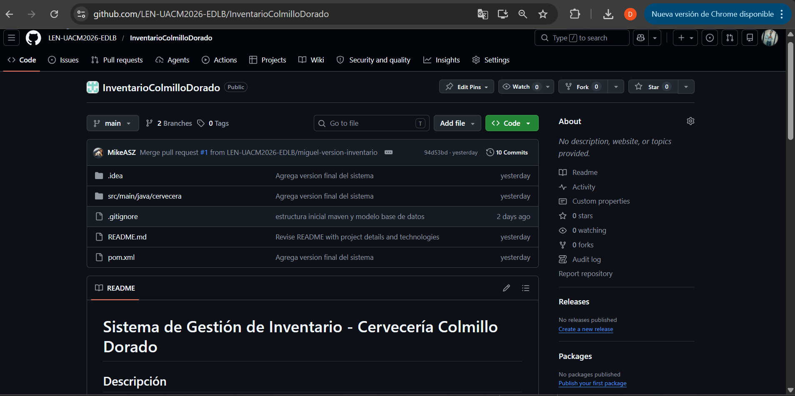
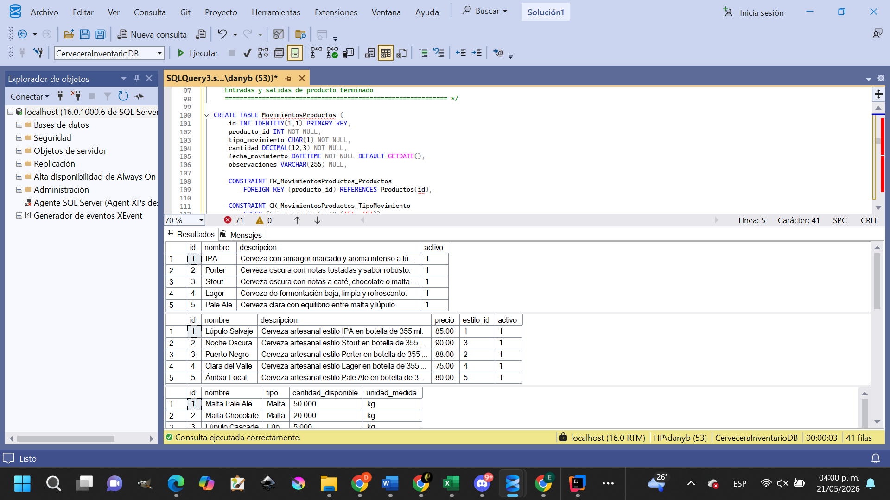
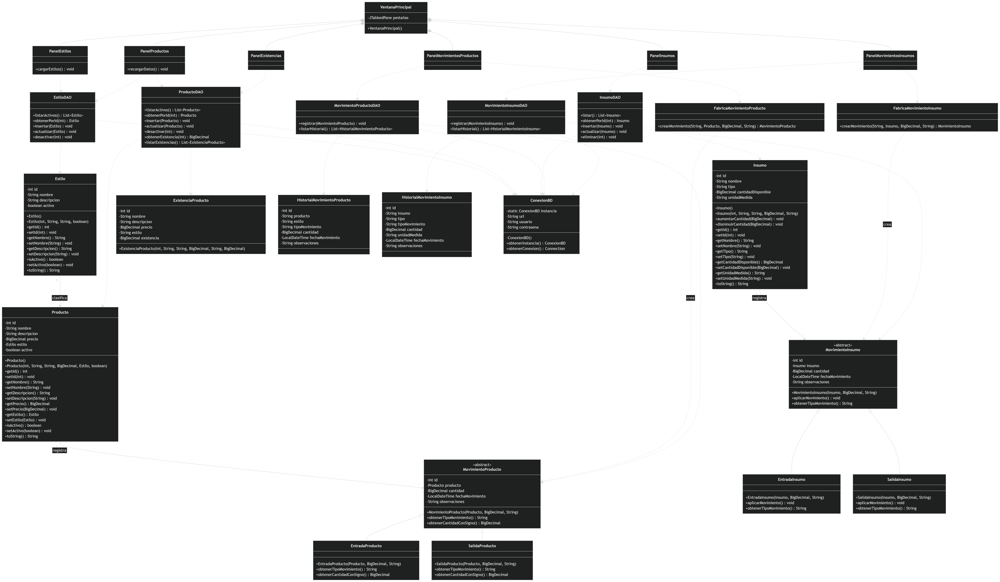
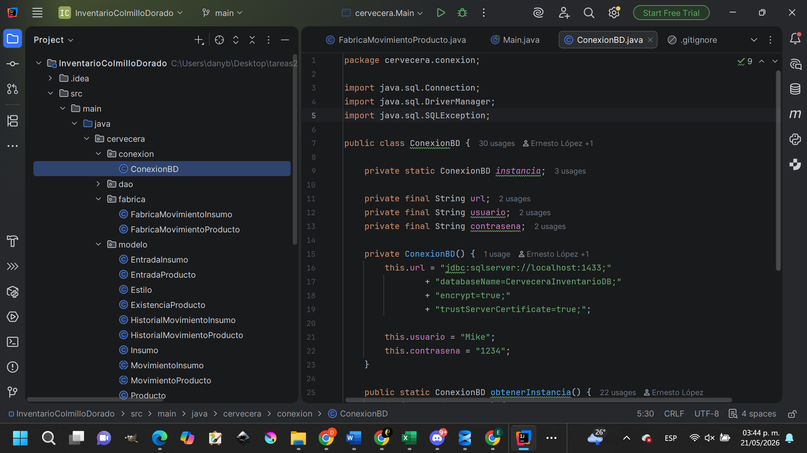
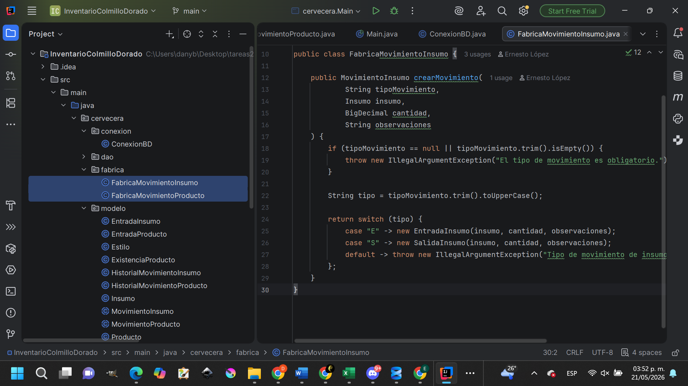
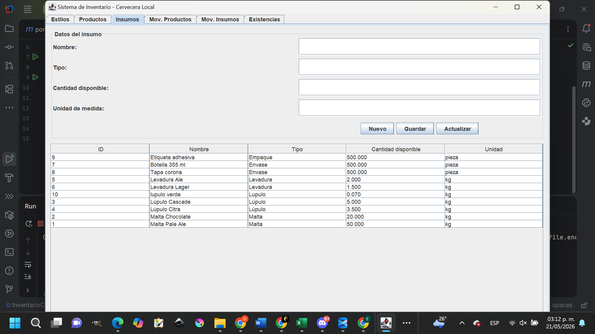

# Universidad Autónoma de la Ciudad de México
## Licenciatura en Ingeniería de Software

### REPORTE TÉCNICO: SISTEMA DE CONTROL DE INVENTARIO
**Curso:** Lenguajes de Programación  
**Profesor:** Dr. José Luis Quiroz Fabián  
**Autores:** 
* Miguel Ángel Suarez Zavala
* Ernesto Daniel López Bedolla

---

## Contenido
1. [Introducción y Descripción del Problema](#introducción-y-descripción-del-problema)
2. [Justificación del Entorno de Desarrollo](#justificación-del-entorno-de-开发)
3. [Diseño de la Arquitectura (POO)](#diseño-de-la-arquitectura-poo)
4. [Patrones de Diseño Implementados](#patrones-de-diseño-implementados)
5. [Tabla de Transparencia en el Uso de IA](#tabla-de-transparencia-en-el-uso-de-ia)
6. [Conclusiones](#conclusiones)

---

## Introducción y Descripción del Problema

En la producción manufacturera artesanal, específicamente en el sector cervecero, el control de inventarios es crítico. La **Cervecería Colmillo Dorado** requería gestionar con precisión:

* **Materias Primas:** Maltas (kg), Lúpulos (kg) y Levaduras (kg).
* **Insumos de Empaque:** Botellas y tapas (piezas).
* **Producto Terminado:** Trazabilidad de estilos de cerveza producidos.

La falta de un sistema centralizado generaba riesgos como la ruptura de stock en plena cocción. La solución implementada es una **Aplicación de Escritorio en Java** que automatiza el registro, previene inventarios negativos mediante excepciones lógicas y centraliza la operación en una base de datos relacional.

---

## Justificación del Entorno de Desarrollo

* **Java (JDK 17 LTS):** Elegido por su tipado fuerte y madurez. Facilita la implementación de una arquitectura limpia basada en POO.
* **Microsoft SQL Server:** Utilizado para garantizar la integridad transaccional y el manejo robusto de llaves foráneas.
* **Java Swing:** Se optó por este framework para la GUI por su portabilidad nativa, eliminando dependencias externas complejas y asegurando que la aplicación corra sin problemas durante la demostración.
* **Repisitorio GitHub:** [Acceso al Repositorio](https://github.com/LEN-UACM2026-EDLB/InventarioColmilloDorado.git)

> *Nota: Reemplaza los siguientes marcadores con las rutas relativas de tus capturas cuando las subas al repositorio.*

   
*Figura 1. Repositorio GitHub.*

 
*Figura 2. Estructura CerveceriaColmilloDoradoDB.*

---

## Diseño de la Arquitectura (POO)

El sistema se estructuró siguiendo los pilares de la **Programación Orientada a Objetos (POO)**:

* **Encapsulamiento:** Clases como `Insumo` y `Producto` protegen sus estados con atributos privados, exponiéndolos mediante *getters* y *setters* que validan la integridad de los datos.
* **Herencia y Abstracción:** Se implementó la clase abstracta `MovimientoInsumo` (y `MovimientoProducto`), que sirve de base para `EntradaInsumo` y `SalidaInsumo`. Esto permite reutilizar lógica común de transacciones.
* **Polimorfismo:** Se evidencia en la capacidad de procesar distintos tipos de movimientos bajo una misma interfaz de lógica, adaptando el comportamiento (sumar o restar stock) según el objeto concreto.
* **Composición y Asociación:** Como se ve en el paquete `cervecera`, los objetos interactúan de forma compleja; por ejemplo, un `MovimientoInsumo` está asociado intrínsecamente a un objeto `Insumo`.

### Diagrama de clases

  
*Figura 3. Diagrama de Clases UML.*

---

## Patrones de Diseño Implementados

Para elevar la calidad del software, se aplicaron dos patrones fundamentales:

### 1. Patrón Creacional: Singleton (`ConexionBD`)
* **Propósito:** Garantizar una única instancia de conexión a SQL Server.
* **Justificación:** Abrir conexiones es costoso. El método `getConexion()` asegura que toda la aplicación (desde los DAOs) reutilice un único canal, optimizando el rendimiento del servidor.

*Figura 4. Implementación de ConexionBD en IntelliJ IDEA.*

### 2. Patrón Creacional: Factory Method (`FabricaMovimientoInsumo` / `FabricaMovimientoProducto`)
* **Propósito:** Desacoplar la creación de objetos de movimiento de la interfaz de usuario.
* **Justificación:** La vista (`PanelMovimientosInsumos`) no necesita saber cómo se instancia una "Entrada" o una "Salida". La fábrica encapsula esta lógica, facilitando la extensión del sistema si en el futuro se agregan tipos como "Mermas".

 
*Figura 5. Clases de Fábrica en el Entorno de Desarrollo.*

---

## Tabla de Transparencia en el Uso de IA

| Componente del Proyecto | % IA | Herramienta | Descripción del Uso |
| :--- | :---: | :--- | :--- |
| **Diseño Esquema SQL** | 20% | Gemini | Generación de script base y restricciones CHECK. |
| **Arquitectura de Conexión** | 40% | Gemini | Estructura del Singleton y manejo de excepciones JDBC. |
| **Modelado de Clases** | 10% | Copilot | Estructura inicial de modelos (POJOs). |
| **Patrón Factory** | 30% | Gemini | Propuesta de abstracción para la lógica de fábricas. |

---

## Conclusiones

La ejecución de este proyecto permitió consolidar la teoría en una herramienta funcional. La organización del código en paquetes (`dao`, `modelo`, `vista`, `fabrica`, `conexion`) demuestra que un diseño previo reduce errores. El uso de patrones de diseño no fue solo un requisito académico, sino una solución real a problemas de acoplamiento y eficiencia de memoria.

 
*Figura 6. Interfaz gráfica (GUI) del sistema ejecutándose.*
